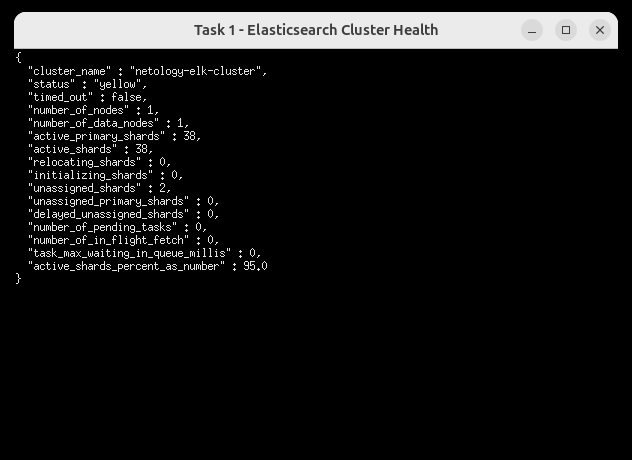
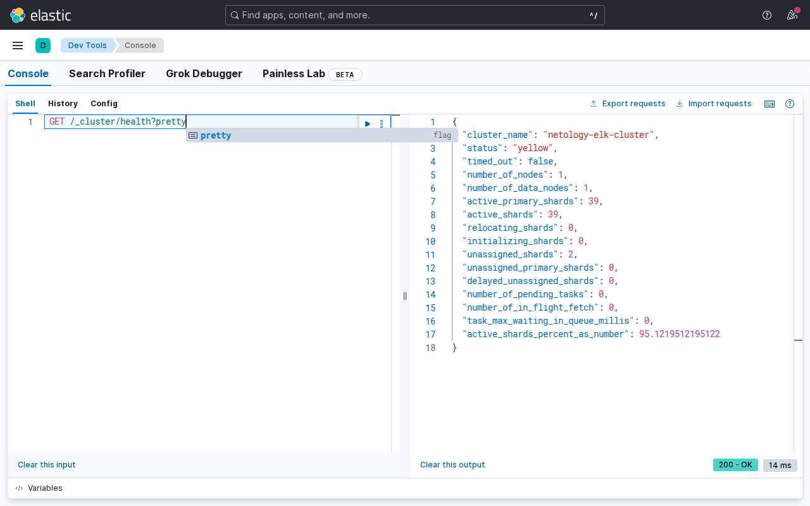
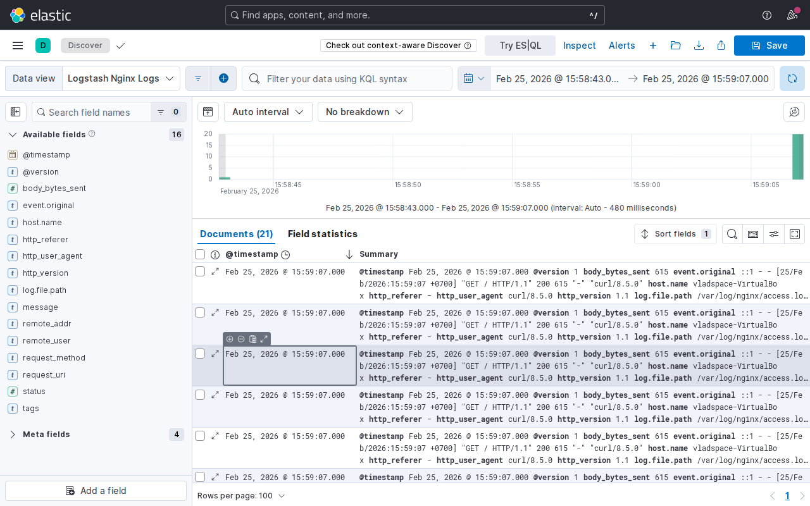
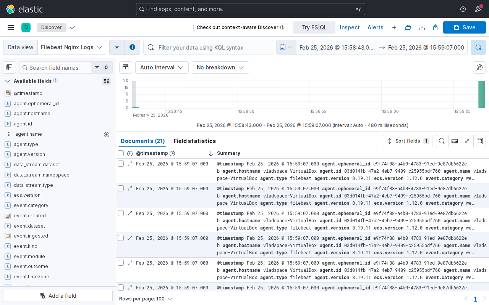

# Домашнее задание: ELK (Elasticsearch, Logstash, Kibana, Filebeat)

## Описание

Развёртывание стека ELK с помощью Docker Compose для сбора и визуализации логов Nginx.

## Структура проекта

```
elk-hw/
├── docker-compose.yml
├── logstash/
│   ├── config/
│   │   └── logstash.yml
│   └── pipeline/
│       └── logstash.conf
├── filebeat/
│   └── filebeat.yml
├── nginx/
│   └── nginx.conf
├── img/
└── README.md
```

## Компоненты

| Сервис        | Образ                                  | Порт  |
|---------------|----------------------------------------|-------|
| Elasticsearch | `elasticsearch:8.6.0`                  | 9200  |
| Kibana        | `kibana:8.6.0`                         | 5601  |
| Logstash      | `logstash:8.6.0`                       | —     |
| Filebeat      | `docker.elastic.co/beats/filebeat:8.6.0` | —   |
| Nginx         | `nginx:latest`                         | 8080  |

## Запуск

```bash
docker compose up -d
```

## Задание 1 — Elasticsearch

Запуск Elasticsearch с кастомным именем кластера `netology-elk-cluster`:

```bash
docker compose up -d elasticsearch
curl -X GET 'localhost:9200/_cluster/health?pretty'
```



## Задание 2 — Kibana

Kibana доступна по адресу http://localhost:5601. Проверка здоровья кластера через Dev Tools:

```
GET /_cluster/health?pretty
```



## Задание 3 — Logstash + Nginx

Logstash собирает access-логи Nginx, парсит их с помощью grok-фильтра `COMBINEDAPACHELOG` и отправляет в Elasticsearch в индекс `logstash-nginx-*`.

Генерация трафика:

```bash
for i in $(seq 1 50); do curl -s http://localhost:8080/ > /dev/null; done
```



## Задание 4 — Filebeat

Filebeat собирает access-логи Nginx и отправляет их напрямую в Elasticsearch в индекс `filebeat-nginx-*`.


